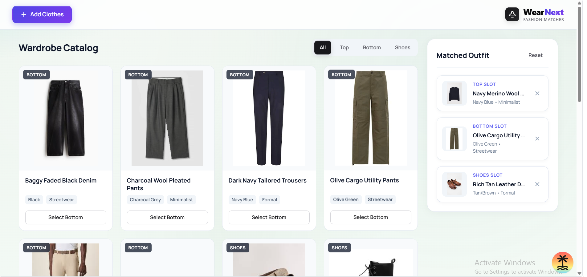
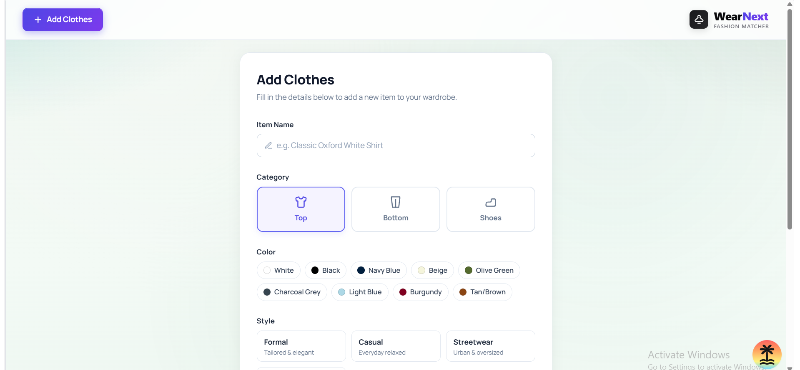
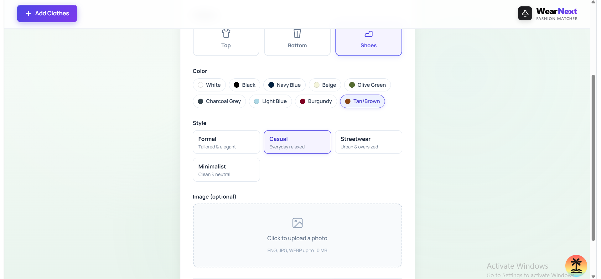
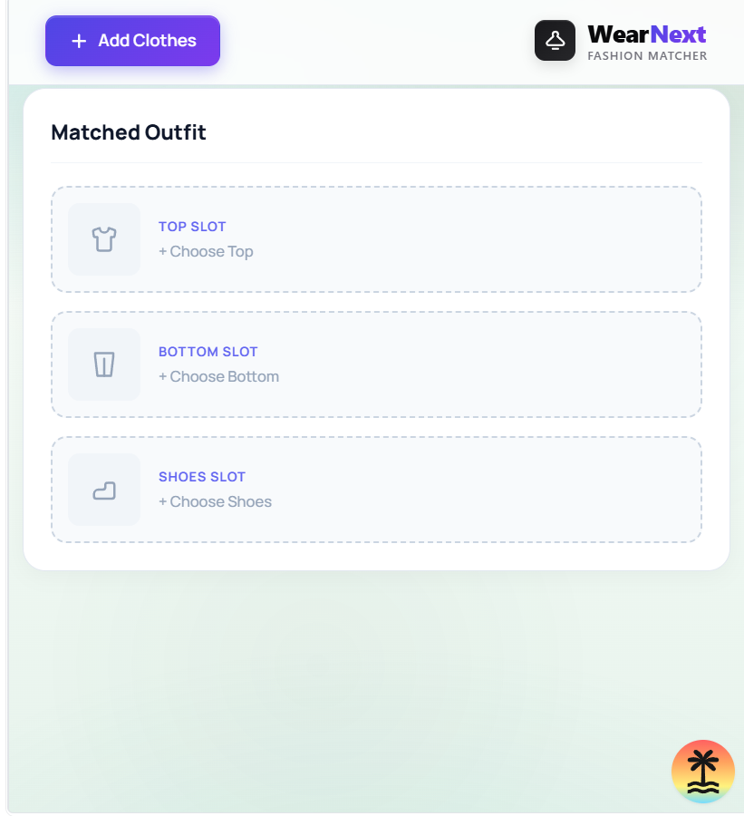
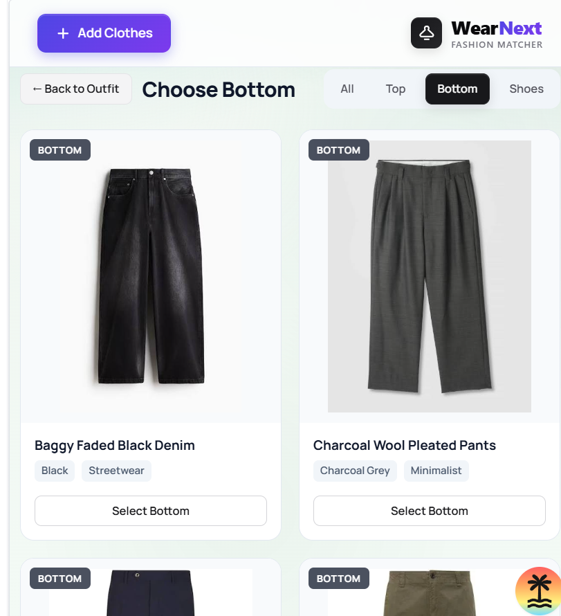
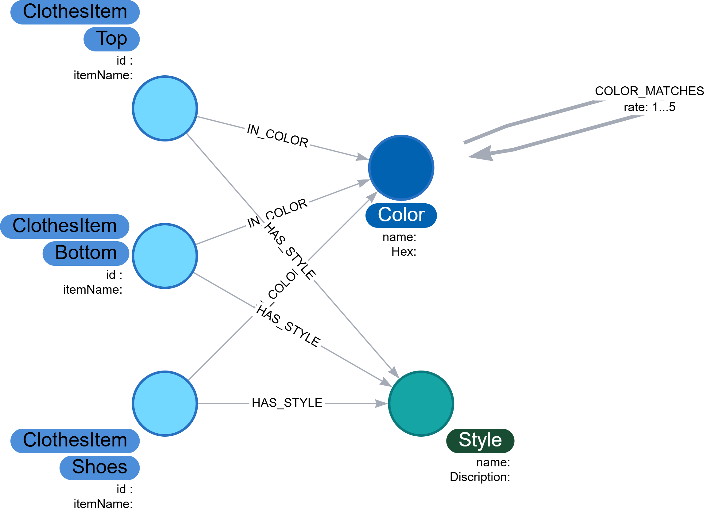

# 👗 WearNext — Graph-Powered Smart Outfit Matcher

> **WearNext** is an intelligent, graph-native wardrobe curation and outfit recommendation engine built with **CognoDB / Neo4j**, **TanStack Start**, **React 19**, and **Tailwind CSS**. It leverages graph traversals and semantic relationships to dynamically suggest harmonious clothing combinations based on color theory, style aesthetics, and curated stylist capsules.

---

## 📌 Table of Contents
- [✨ The Use Case](#-the-use-case)
- [🖥️ UI Gallery & Application Showcase](#️-ui-gallery--application-showcase)
- [🕸️ Why a Graph Database?](#️-why-a-graph-database)
- [📑 Architectural Decision Record (ADR)](#-architectural-decision-record-adr)
  - [1. Context & Problem Statement](#1-context--problem-statement)
  - [2. Considered Architectural Options](#2-considered-architectural-options)
  - [3. Decision Outcome: Graph-Based First-Class Entities](#3-decision-outcome-graph-based-first-class-entities)
  - [4. Scalability Considerations](#4-scalability-considerations)
- [📊 Data Model & Architecture](#-data-model--architecture)
  - [Graph Schema Diagram](#graph-schema-diagram)
  - [Nodes (Labels)](#nodes-labels)
  - [Relationships (Edges)](#relationships-edges)
- [🛠️ Setup and Run Instructions](#️-setup-and-run-instructions)
  - [Prerequisites](#prerequisites)
  - [Step 1: Creating a CognoDB Instance](#step-1-creating-a-cognodb-instance)
  - [Step 2: Clone and Install Dependencies](#step-2-clone-and-install-dependencies)
  - [Step 3: Configure Environment Variables](#step-3-configure-environment-variables)
  - [Step 4: Initialize Schema & Seed Data](#step-4-initialize-schema--seed-data)
  - [Step 5: Run the Development Server](#step-5-run-the-development-server)
- [🔍 Main Cypher Queries Explained](#-main-cypher-queries-explained)
  - [1. Recommendation Engine Query (`getMatchingSuggestions`)](#1-recommendation-engine-query-getmatchingsuggestions)
  - [2. Fetch All Wardrobe Items (`getAllClothes`)](#2-fetch-all-wardrobe-items-getallclothes)
  - [3. Add New Item with Semantic Links (`addClothesItem`)](#3-add-new-item-with-semantic-links-addclothesitem)
  - [4. Direct Stylist Override Query](#4-direct-stylist-override-query)
- [🖥️ UI & User Experience Walkthrough](#️-ui--user-experience-walkthrough)
  - [1. Interactive Outfit Builder (Homepage)](#1-interactive-outfit-builder-homepage)
  - [2. Add Clothes to Wardrobe (/clothes/add)](#2-add-clothes-to-wardrobe-clothesadd)
  - [3. Responsive Mobile View](#3-responsive-mobile-view)
- [📁 Project Structure](#-project-structure)
- [📜 Tech Stack](#-tech-stack)

---

## ✨ The Use Case

Choosing an outfit involves multi-dimensional rules of harmony:
- **Color Compatibility:** Does Navy Blue go with Beige? Does Olive Green complement Burgundy?
- **Style Cohesion:** Does a Minimalist merino sweater pair with Formal tailored trousers or Streetwear baggy denim?
- **Category Constraints:** An outfit consists of distinct item slots (`Top` + `Bottom` + `Shoes`). Adding a Top should filter recommendations for remaining empty slots (`Bottom` and `Shoes`) without suggesting duplicate Tops.
- **Curated Stylist Overrides:** High-priority editorial looks (capsule collections) should instantly surface pairings that transcend basic algorithmic color rules.

**WearNext** solves the *"what should I wear with this?"* problem in real-time. As you select an item (e.g., a *Classic Oxford White Shirt*), the recommendation engine traverses the knowledge graph to score and re-rank candidate bottoms and shoes by color harmony ratings, matching styles, and editorial pairings.

---

## 🖥️ UI Gallery & Application Showcase

### 1. Homepage / Smart Outfit Matcher


### 2. Add Clothes Modal


### 3. Category & Palette Customization


### 4. Responsive Mobile Drawer View


### 5. Mobile Outfit Canvas


---

## 🕸️ Why a Graph Database?

Traditional relational databases (SQL) and document stores (MongoDB) struggle with interconnected aesthetic domains.

```
Relational / Document DB:
  Item ──(Foreign Keys / Multi-table JOINs)──> Colors / Styles ──(Matrix Table Scan)──> Matches
  Complexity: O(N * M) or O(N) full catalog scans on every selection.

Graph Database (CognoDB / Neo4j):
  (Top:ClothesItem)-[:IN_COLOR]->(Color)-[:COLOR_MATCHES]->(Color)<-[:IN_COLOR]-(Bottom:ClothesItem)
  Complexity: O(d) Localized graph traversal where d = degree of connected nodes.
```

### The Relational & Property-Based Anti-Pattern
1. **Expensive Multi-Way JOINs:** Finding matching bottoms for a top requires joining Items $\to$ Colors $\to$ Color_Compatibility $\to$ Colors $\to$ Items, intersecting with Items $\to$ Styles $\to$ Items. As catalog size grows, query latency degrades sharply.
2. **Combinatorial Explosion in App Code:** Calculating multi-item outfit synergy (Top + Bottom + Shoes) in application memory requires nested loops ($O(N \times M \times K)$).
3. **High Maintenance Overhead:** Adding a new item in relational models often requires writing dozens of explicit row pairings into a junction table.

### The Graph Advantage (Index-Free Adjacency)
1. **Localized Graph Traversal ($O(d)$):** Instead of scanning the entire inventory, the query starts at the selected node and only explores adjacent `:Color` and `:Style` relationships.
2. **First-Class Entities for Color & Style:** By modeling `Color` and `Style` as independent nodes connected by weighted edges (`:COLOR_MATCHES {rate: 1..5}`), the entire compatibility matrix is stored once in the graph topology.
3. **Zero-Maintenance Catalog Expansion:** When a user adds a new garment, the system simply creates two edges: `(:ClothesItem)-[:IN_COLOR]->(:Color)` and `(:ClothesItem)-[:HAS_STYLE]->(:Style)`. All multi-hop outfit recommendations are resolved automatically by the graph engine.
4. **Editorial Overrides via Direct Edges:** Stylists can add a direct `(:ClothesItem)-[:DIRECT_OVERRIDE {rate: 5}]->(:ClothesItem)` edge to define signature capsules without changing algorithmic rules.

---

## 📑 Architectural Decision Record (ADR)

### 1. Context & Problem Statement
In apparel recommendation engines, items must be matched across multiple aesthetic dimensions (color harmony, occasion appropriateness, silhouette style, and stylist capsules). How should item attributes like color and style be modeled to optimize query latency and minimize maintenance overhead as the wardrobe expands?

### 2. Considered Architectural Options
1. **Option 1 — Property-Based Storage:** Store color, category, and style as raw string/scalar properties directly on `ClothesItem` nodes (e.g. `item.color = "Navy Blue"`, `item.style = "Formal"`).
2. **Option 2 — Graph-Based First-Class Entities (Selected):** Extract `Color` and `Style` into independent first-class nodes connected via semantic edges (`:IN_COLOR`, `:HAS_STYLE`, `:COLOR_MATCHES`).

---

### 3. Decision Outcome: Graph-Based First-Class Entities

#### Why Option 1 (Property-Based) Was Rejected:
* **$O(N)$ Catalog Scans:** Querying for matching garments requires scanning every item node in the database to filter by color strings.
* **Combinatorial Complexity:** Computing multi-item compatibility in application code requires nested iterations at $O(N \times M)$ complexity.
* **Rigid Pairing Matrix:** Adding a new clothing item would require generating explicit matching edges to every compatible garment in the catalog.

#### Why Option 2 (Graph-Based First-Class Entities) Was Chosen:
* **Index-Free Adjacency ($O(d)$ Complexity):** Finding matching bottoms for a given top only traverses adjacent edges of the top's `:Color` and `:Style` nodes. Query complexity drops from $O(N)$ (total items in catalog) to $O(d)$ (degree of connected attribute nodes).
* **Declarative Recommendation Deduction:** Outfit compatibility is resolved natively inside Cypher by traversing:
  $$\text{Top} \xrightarrow{\text{:IN\_COLOR}} \text{Color}_1 \xrightarrow{\text{:COLOR\_MATCHES}} \text{Color}_2 \xleftarrow{\text{:IN\_COLOR}} \text{Bottom}$$
  intersected with:
  $$\text{Top} \xrightarrow{\text{:HAS\_STYLE}} \text{Style} \xleftarrow{\text{:HAS\_STYLE}} \text{Bottom}$$
* **Zero-Maintenance Growth:** When a new `ClothesItem` is registered, it only needs edges to its corresponding `:Color` and `:Style`. All 2-hop and 3-hop outfit combinations are inferred automatically.
* **Dynamic Stylist Overrides:** High-priority direct pairings (`:DIRECT_OVERRIDE`) allow editorial capsules to override or boost default algorithmic matching without schema changes.

---

### 4. Scalability Considerations
* **Personal Wardrobes:** In single-user personal wardrobe scenarios, item counts remain compact, allowing low-latency query evaluation and simple caching.
* **Multi-Tenant / Shared Wardrobes:** For multi-user or enterprise catalogs, items are easily partitioned under a `(:User)-[:OWNS]->(:ClothesItem)` relationship, enabling user-scoped query filtering directly in the Cypher execution plan.

---

## 📊 Data Model & Architecture

### Graph Schema Diagram



### Nodes (Labels)
- **`:ClothesItem`**: The base label for all wardrobe items (properties: `id`, `itemName`).
  - **`:Top`**: Topwear garments (Shirts, Sweaters, Jackets, Tees).
  - **`:Bottom`**: Bottomwear garments (Trousers, Chinos, Jeans, Pants).
  - **`:Shoes`**: Footwear (Sneakers, Loafers, Derby Shoes, Boots).
- **`:Color`**: Color entity with hex code (properties: `name`, `hex`).
- **`:Style`**: Fashion aesthetic category (properties: `name`, `description`).

### Relationships (Edges)
| Relationship | Source $\to$ Target | Description |
| :--- | :--- | :--- |
| **`:IN_COLOR`** | `(:ClothesItem) -> (:Color)` | Connects an item to its primary color node |
| **`:HAS_STYLE`** | `(:ClothesItem) -> (:Style)` | Associates an item with an aesthetic category |
| **`:COLOR_MATCHES`** | `(:Color) <-> (:Color)` | Symmetrical compatibility rating (`rate: 1..5`) between colors |
| **`:DIRECT_OVERRIDE`** | `(:ClothesItem) <-> (:ClothesItem)` | High-priority curated pairing (`rate: 1..5`, `note: string`) |

---

## 🛠️ Setup and Run Instructions

### Prerequisites
- **Node.js** >= 20.x
- **pnpm** (recommended) or `npm` / `yarn`
- A **CognoDB** (or Neo4j v5+) instance

---

### Step 1: Creating a CognoDB Instance

1. Navigate to [CognoDB Cloud Console](https://cognodb.com) (or your managed Neo4j provider).
2. Click **Create New Database / Instance**.
3. Choose an instance name (e.g., `wearnext-db`) and select your preferred cloud region.
4. Save the generated connection credentials:
   - **Bolt URI** (e.g., `bolt+s://db-xxxxxx.databases.cognodb.com`)
   - **Username** (default: `cognodb` or `neo4j`)
   - **Password** (the generated secret password)

---

### Step 2: Clone and Install Dependencies

```bash
# Clone the repository
git clone https://github.com/TalalEmara/WearNext-Outfit-Match.git
cd WearNext-Outfit-Match/wear_next

# Install dependencies
pnpm install
```

---

### Step 3: Configure Environment Variables

Create a `.env` file in the `wear_next/` root directory:

```env
COGNO_URI=bolt+s://db-xxxxxx.databases.cognodb.com
COGNO_USER=cognodb
COGNO_PASSWORD=your_secure_password_here
```

---

### Step 4: Initialize Schema & Seed Data

Run the database migration scripts to apply unique constraints, performance indexes, and seed curated fashion data:

```bash
# 1. Initialize constraints (unique IDs, color names, style names, search indexes)
pnpm db:init

# 2. Seed initial catalog, styles, color harmony matrix, and stylist capsules
pnpm db:seed
```

---

### Step 5: Run the Development Server

```bash
pnpm dev
```

The app will be running at `http://localhost:3000`.

---

## 🔍 Main Cypher Queries Explained

### 1. Recommendation Engine Query (`getMatchingSuggestions`)

**File:** `wear_next/src/functions/queries/getMatchingSuggestions.ts`

This is the core graph inference engine. When items are selected in the outfit builder, this query executes in 5 logical stages:

```cypher
// ── 1. Gather context from selected items ───────────────────
MATCH (sel:ClothesItem)
WHERE sel.id IN $selectedIds
MATCH (sel)-[:IN_COLOR]->(selColor:Color)
MATCH (sel)-[:HAS_STYLE]->(selStyle:Style)
WITH
  collect(DISTINCT
    CASE WHEN sel:Top THEN 'Top' WHEN sel:Bottom THEN 'Bottom' ELSE 'Shoes' END
  ) AS usedCats,
  collect(DISTINCT selColor) AS selColors,
  collect(DISTINCT selStyle) AS selStyles

// ── 2. Candidate items in a DIFFERENT category ──────────────
MATCH (item:ClothesItem)-[:IN_COLOR]->(c:Color), (item)-[:HAS_STYLE]->(s:Style)
WHERE NOT (
  CASE WHEN item:Top THEN 'Top' WHEN item:Bottom THEN 'Bottom' ELSE 'Shoes' END
  IN usedCats
)

// ── 3. Pre-compute exact-match booleans ─────────────────────
WITH item, c, s,
  (c IN selColors) AS sameColor,
  (s IN selStyles) AS sameStyle,
  selColors

// ── 4. Score color compatibility via COLOR_MATCHES ──────────
OPTIONAL MATCH (c)-[cm:COLOR_MATCHES]->(matched:Color)
WHERE matched IN selColors

WITH item, c, s, sameColor, sameStyle,
  max(coalesce(cm.rate, 0)) AS colorCompatRate

// ── 5. Total score and filter ───────────────────────────────
WITH item, c, s,
  (CASE WHEN sameColor THEN 3 ELSE 0 END) +
  (CASE WHEN sameStyle THEN 2 ELSE 0 END) +
  colorCompatRate AS score

WHERE score > 0

RETURN
  item.id       AS id,
  item.itemName AS itemName,
  CASE WHEN item:Top THEN 'Top' WHEN item:Bottom THEN 'Bottom' ELSE 'Shoes' END AS category,
  c.name        AS color,
  s.name        AS style,
  score         AS matchScore
ORDER BY matchScore DESC, itemName
```

#### Why this query is powerful:
- **Category Pruning:** Excludes any category already present in `$selectedIds` (`WHERE NOT category IN usedCats`).
- **Scoring Weights:**
  - `+3` for exact monochromatic color matches.
  - `+2` for matching aesthetic style.
  - `+1..5` for semantic color harmony via `:COLOR_MATCHES`.
- **Index-Free Traversal:** Traverses only the candidate's immediate edges to reach harmony nodes, guaranteeing sub-millisecond responses.

---

### 2. Fetch All Wardrobe Items (`getAllClothes`)

**File:** `wear_next/src/functions/queries/getAllClothes.ts`

Fetches all items along with their connected color and style nodes:

```cypher
MATCH (item:ClothesItem)-[:IN_COLOR]->(c:Color), (item)-[:HAS_STYLE]->(s:Style)
RETURN
  item.id       AS id,
  item.itemName AS itemName,
  CASE
    WHEN item:Top    THEN 'Top'
    WHEN item:Bottom THEN 'Bottom'
    ELSE 'Shoes'
  END           AS category,
  c.name        AS color,
  s.name        AS style
ORDER BY category, itemName
```

---

### 3. Add New Item with Semantic Links (`addClothesItem`)

**File:** `wear_next/src/functions/mutations/addClothesItem.ts`

Creates a new item node with category labels and attaches relationships to existing `:Color` and `:Style` nodes:

```cypher
MERGE (item:ClothesItem:$category { id: $id })
SET item.itemName = $itemName
WITH item
MATCH (c:Color { name: $color })
MERGE (item)-[:IN_COLOR]->(c)
WITH item
MATCH (s:Style { name: $style })
MERGE (item)-[:HAS_STYLE]->(s)
```

---

### 4. Direct Stylist Override Query

**File:** `wear_next/src/db/seed.ts`

Creates bi-directional editorial links between signature pieces:

```cypher
MATCH (i1:ClothesItem { id: $item1Id })
MATCH (i2:ClothesItem { id: $item2Id })
MERGE (i1)-[r1:DIRECT_OVERRIDE { rate: 5, note: $note }]->(i2)
MERGE (i2)-[r2:DIRECT_OVERRIDE { rate: 5, note: $note }]->(i1)
```

---

## 🖥️ UI & User Experience Walkthrough

### 1. Interactive Outfit Builder (Homepage)
- **Left Panel (Wardrobe Catalog):** Browse available items with category filter tabs (*All*, *Tops*, *Bottoms*, *Shoes*). Real-time match badges dynamically indicate outfit harmony scores.
- **Right Panel (Current Outfit Slot View):** Visual representation of the active 3-piece outfit (Top, Bottom, Shoes).
  - Clicking an empty slot filters the catalog for matching candidates.
  - Selecting an item automatically advances focus to the next empty slot.
  - Live Harmony Meter provides feedback on overall outfit cohesion.


### 2. Add Clothes to Wardrobe (`/clothes/add`)
- Clean form to register new apparel into your graph database:
  - **Item Name:** Descriptive title (e.g., *Navy Merino Wool Sweater*).
  - **Category:** Pill toggle between `Top`, `Bottom`, and `Shoes`.
  - **Color Palette Picker:** Interactive color swatches mapped directly to `:Color` graph nodes.
  - **Style Selector:** Aesthetic pills (`Formal`, `Casual`, `Streetwear`, `Minimalist`).
  - **Photo Upload:** Upload preview with local storage in `/public/images/`.

| Add Clothes View | Palette & Style Selection |
| :---: | :---: |
|  |  |

### 3. Responsive Mobile View
- Dynamic drawer and tab view tailored for mobile screens, allowing seamless switching between catalog browsing and the current outfit canvas.

| Mobile View Drawer | Mobile Canvas |
| :---: | :---: |
|  |  |

---

## 📁 Project Structure

```
WearNext-Outfit-Match/
├── README.md                          # Main project documentation
├── image.png                          # UI Screenshot: Homepage
├── image-1.png                        # UI Screenshot: Add clothes form
├── image-2.png                        # UI Screenshot: Style and color picker
├── image-4.png                        # UI Screenshot: Mobile catalog drawer
├── image-5.png                        # UI Screenshot: Mobile outfit canvas
└── wear_next/
    ├── .env                           # CognoDB connection secrets
    ├── package.json                   # Scripts and project dependencies
    ├── vite.config.ts                 # TanStack Start & Tailwind Vite config
    ├── public/
    │   └── images/                    # Uploaded garment images
    └── src/
        ├── routes/
        │   ├── __root.tsx             # Root layout with navigation
        │   ├── index.tsx              # Homepage: Catalog + Outfit Preview
        │   └── clothes.add.tsx        # Add new clothing item form
        ├── components/
        │   ├── CatalogGrid/           # Grid showing clothes & match badges
        │   ├── MatchedOutfitPreview/  # 3-slot outfit preview & harmony score
        │   ├── ItemCard/              # Garment card with visual styling
        │   ├── ColorPicker/           # Interactive color swatch selection
        │   ├── StyleSelector/         # Style aesthetic chips
        │   └── CategorySelector/      # Category tabs (Top, Bottom, Shoes)
        ├── db/
        │   ├── graph.png              # Graph schema diagram
        │   ├── init.ts                # Database schema constraints & indexes
        │   ├── seed.ts                # Database seed script
        │   └── readme.md              # Architectural decision record (ADR)
        ├── functions/
        │   ├── cognoConnection.ts     # Neo4j/CognoDB driver connection singleton
        │   ├── logger.ts              # Error logging utility
        │   ├── queries/               # Cypher queries (getAllClothes, getMatchingSuggestions)
        │   └── mutations/             # Cypher mutations (addClothesItem)
        └── types/                     # TypeScript interfaces and types
```

---

## 📜 Tech Stack

| Layer | Technology |
| :--- | :--- |
| **Database** | [CognoDB](https://cognodb.com) / [Neo4j](https://neo4j.com) (Graph Database) |
| **Driver** | `neo4j-driver` (v6.2.0 Bolt Protocol) |
| **Framework** | [TanStack Start](https://tanstack.com/start) + [TanStack Router](https://tanstack.com/router) |
| **Frontend** | [React 19](https://react.dev) |
| **Styling** | [Tailwind CSS v4](https://tailwindcss.com) + CSS Modules |
| **Language** | [TypeScript](https://www.typescriptlang.org) |

---